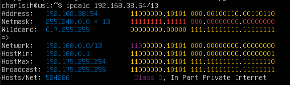
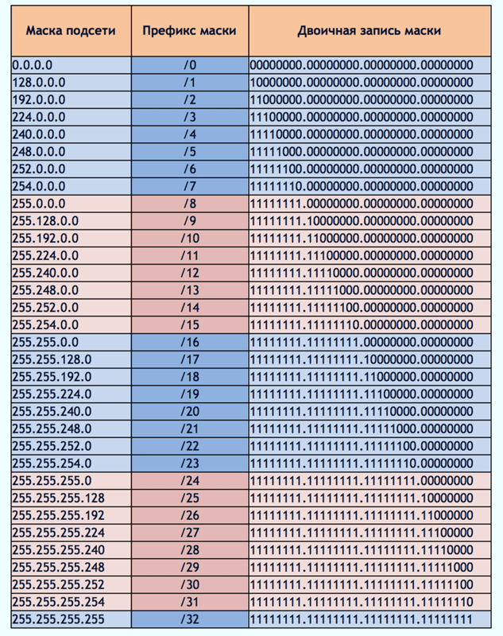

# Linux Network 

Linux networks configuration on virtual machines

# Contents

1. [Part 1. Инструмент ipcalc](#part-1-инструмент-ipcalc)
    1. [1.1. Сети и маски](#11-сети-и-маски)
    2. [1.2. localhost](#12-localhost)
    3. [1.3. Диапазоны и сегменты сетей](#13-диапазоны-и-сегменты-сетей)
2. [Part 2. Статическая маршрутизация между двумя машинами](#part-2-статическая-маршрутизация-между-двумя-машинами)
    1. [2.1. Добавление статического маршрута вручную](#21-добавление-статического-маршрута-вручную)
    2. [2.2. Добавление статического маршрута с сохранением](#22-добавление-статического-маршрута-с-сохранением)
3. [Part 3. Утилита iperf3](#part-3-утилита-iperf3)
    1. [3.1. Скорость соединения](#31-скорость-соединения)
    2. [3.2. Утилита iperf3](#32-утилита-iperf3)
4. [Part 4. Сетевой экран](#part-4-сетевой-экран)
    1. [4.1. Утилита iptables](#41-утилита-iptables)
    2. [4.2. Утилита nmap](#42-утилита-nmap)
5. [Part 5. Статическая маршрутизация сети](#part-5-статическая-маршрутизация-сети)
    1. [5.1. Настройка адресов машин](#51-настройка-адресов-машин)
    2. [5.2. Включение переадресации IP-адресов](#52-включение-переадресации-ip-адресов)
    3. [5.3. Установка маршрута по-умолчанию](#53-установка-маршрута-по-умолчанию)
    4. [5.4. Добавление статических маршрутов](#54-добавление-статических-маршрутов)
    5. [5.5. Построение списка маршрутизаторов](#55-построение-списка-маршрутизаторов)
    6. [5.6. Использование протокола **ICMP** при маршрутизации](#56-использование-протокола-icmp-при-маршрутизации)
6. [Part 6. Динамическая настройка IP с помощью DHCP](#part-6-динамическая-настройка-ip-с-помощью-dhcp)
7. [Part 7. NAT](#part-7-nat)
8. [Part 8. Дополнительно. Знакомство с SSH Tunnels](#part-8-дополнительно-знакомство-с-ssh-tunnels)


## Part 1. Инструмент ipcalc

### 1.1. Сети и маски

**Поднять виртуальную машину (далее -- ws1)**

**Установить ipcalc:** `sudo apt install ipcalc`


**Получить информацию о сетевом адресе:** `ipcalc 192.167.38.54/13`




**Маска подсети** — битовая маска для определения по IP-адресу адреса подсети и адреса узла (хоста, компьютера, устройства) этой подсети. В отличие от IP-адреса маска подсети не является частью IP-пакета.

Благодаря маске можно узнать, какая часть IP-адреса узла сети относится к адресу сети, а какая — к адресу самого узла в этой сети.


**Таблица сетевых масок, префикс маски, двоичная запись маски.**



- **Определить и записать в отчёт:**
    - адрес сети 192.167.38.54/13
    > 192.160.0.0
   
    

    - перевод маски 
       - 255.255.255.0 в префиксную и двоичную запись, 
         > /24, 11111111.11111111.11111111.00000000
         
         
      
       - /15 в обычную и двоичную, 
         > 255.254.0.0, 11111111.11111110.00000000.00000000
         
         
      
       - 11111111.11111111.11111111.11110000 в обычную и префиксную
         - По таблице сетевых масок 11111111.11111111.11111111.11110000 - это /28
         > 255.255.255.240, /28
         
         
         
    - минимальный и максимальный хост в сети 12.167.38.4 при масках: 
         - /8,
           > 12.0.0.1 и 12.255.255.254
       
           
         
         - 11111111.11111111.00000000.00000000, 
           > 12.167.0.1 и 12.167.255.254
      
           
   
         - 255.255.254.0 и
           > 12.167.38.1 и 12.167.39.254
      
           
   
         - /4
           > 0.0.0.1 и 15.255.255.254
      
           
   
### 1.2. localhost

2. **Определить и записать в отчёт, можно ли обратиться к приложению, работающему на localhost, со следующими IP: 194.34.23.100, 127.0.0.2, 127.1.0.1, 128.0.0.1**

К приложению, работающему на localhost, 

`можно с IP: 127.0.0.2, 127.1.0.1 и нельзя - с IP 194.34.23.100 и 128.0.0.1`.

### 1.3. Диапазоны и сегменты сетей

---

**Список частных(приватных) IP адресов**

Class A   10.0.0.0 - 10.255.255.255   маска   255.0.0.0 \
Class В   172.16.0.0 - 172.31.255.255   маска   255.255.0.0 \
Class С   192.168.0.0 - 192.168.255.255   маска  255.255.255.0

**Списки ip-адресов: классы, частные адреса, адреса обратной связи**


---

3. **Определить и записать в отчёт:**

- какие из перечисленных IP можно использовать в качестве публичного, а какие только в качестве частных: 10.0.0.45, 134.43.0.2, 192.168.4.2, 172.20.250.4, 172.0.2.1, 192.172.0.1, 172.68.0.2, 172.16.255.255, 10.10.10.10, 192.169.168.1
```
Могут использоваться в качестве публичных IP-адресов:

134.43.0.2, 192.172.0.1, 192.169.168.1 и 172.0.2.1, 172.68.0.2
```
```
Могут использоваться только в качестве частных IP-адресов:

10.0.0.45, 10.10.10.10, 172.20.250.4, 172.16.255.255, 192.168.4.2
```

- какие из перечисленных IP адресов шлюза возможны у сети 10.10.0.0/18: 10.0.0.1, 10.10.0.2, 10.10.10.10, 10.10.100.1, 10.10.1.255 

```
У сети 10.10.0.0/18 возможны адреса: 10.10.0.2, 10.10.10.10, 10.10.1.255
```
   


## Part 2. Статическая маршрутизация между двумя машинами

Поднять две виртуальные машины (далее -- ws1 и ws2)

- **С помощью команды** `ip a` **посмотреть существующие сетевые интерфейсы**

В отчёт поместить скрин с вызовом и выводом использованной команды.


- **Описать сетевой интерфейс, соответствующий внутренней сети, на обеих машинах и задать следующие адреса и маски:** `ws1 - 192.168.100.10, маска /16`, `ws2 - 172.24.116.8, маска /12`

`sudo nano /etc/netplan/00-installer-config.yaml`

---

**Создание внутренних сетей VirtualBox**

Графический интерфейс пользователя VirtualBox поддерживает только четыре сетевых адаптера для каждой ВМ. Это ограничивает сложность сетевых сценариев, которые можно создать. \
Каждый сетевой адаптер может быть включен или отключен. Если адаптер включен, его можно настроить на подключение к одному из множества различных типов интерфейсов, предоставляемых VirtualBox.

Чтобы соединить две виртуальные машины друг с другом, используем тип интерфейса Внутренняя сеть. \
Имя внутренней сети должно совпадать с именем, настроенным на соответствующем сетевом адаптере на другой виртуальной машине, которая будет подключена к этой виртуальной машине.

Маршрутизаторы используют три из четырех доступных сетевых адаптеров для подключения к внутренним сетям. \
ПК используют по одному сетевому адаптеру для подключения к внутренним сетям.

Создаем одинаковые настройки для ws1 и для ws2:
- Адаптер 1 - NAT
- Адаптер 2 - Внутренняя сеть (int1)

**NAT (Network Address Translation)** 
- это технология, которая позволяет маршрутизатору или шлюзу переводить адреса сетевых устройств внутри локальной сети в единый внешний IP-адрес. Это позволяет обеспечить безопасность и анонимность в сети, а также упрощает конфигурацию сети. В результате устройства внутри локальной сети могут выходить в Интернет, не имея статического внешнего IP-адреса.


### Netplan 
- утилита, которая используется в Ubuntu для управления конфигурацией сети.

Все конфигурационные файлы Netplan находятся в папке /etc/netplan/. \
`00-installer-config.yaml` это конфигурационный файл для настройки сетевых интерфейсов в системах, использующих netplan. Он содержит информацию о сетевых интерфейсах, настройках IP, DHCP и т.д.

_Синтаксис конфигурации Netplan_

```
network:
renderer: программа_бэкенд
вид_интерфейса:
  имя_интерфейса:
    параметр: значение
version: 2
```
Первая и последняя строчки конфигурации стандартны. Первая указывает, что мы будем иметь дело с сетью, а вторая указывает версию стандарта конфигурации, которая будет использоваться. Их лучше не трогать.

- `renderer` - указывает программу, для которой будут преобразоваться ваши настройки. На данный момент поддерживаются только network-manager и systemd-networkd (можно не прописывать);
- `вид_интерфейса` - вид сетевых интерфейсов, которые вы будете настраивать в этой секции. Они делятся на физические: ethernets (проводные), wifis (беспроводные) и виртуальные: vlans , bonds, bridges.
- `имя_интерфейса` - имя сетевого интерфейса в системе, например enp3s0 или eth0;
- `параметры` - настройки, с помощью которых указывается, как нужно подключаться к сети.

_Параметры Netplan_

- `renderer` - программа для обработки конфигурации;
- `dhcp4` - получение IPv4 адреса по DHCP;
- `dhcp6` - получение IPv6 адреса по DHCP;
- `dhcp-identifier` - если передать значение "mac", то будет использоваться MAC-адрес в качестве идентификатора DHCP;
- `addresses` - добавляет статические адреса к интерфейсу, можно несколько;
- `gateway4` - указывает шлюз IPv4;
- `gateway6` - указывает шлюз IPv6;
- `nameservers` - указывает DNS-серверы;
- `macaddress` - устанавливает новый MAC-адрес;
- `routes` - позволяет настроить маршруты таблицы маршрутизации;
- `routing-policy` - дополнительная настройка маршрутов, для IP или подсети;
- `access-points` - список точек доступа для Wi-Fi;
- `password` - пароль для точки доступа Wi-Fi;
- `mode` - режим работы сетевой карты Wi-Fi.

_Команды Netplan_

`netplan опции команда`

В качестве команды можно передать одну из команд:
- `try` - попробовать применить конфигурацию с возможностью отмены;
- `apply` - применить конфигурацию;
- `generate` - проверка текущей конфигурации и запись на диск;
- `config` - записать текущую конфигурацию сети в YAML.

_Настройка динамического IP в Netplan_

```
network:
version: 2
renderer: networkd
ethernets:
enp3s0:
dhcp4: true
nameservers:
addresses:
- 8.8.8.8
- 8.8.4.4
```
В качестве программы для обработки конфигурации мы используем Networkd, далее мы указываем наш сетевой интерфейс и включаем получение IPv4 адреса по DHCP. Все остальные параметры тоже подтянутся по DHCP. Или мы можем вручную настроить DNS для этого интерфейса.

_Настройка статического IP в Netplan_

```
network:
version: 2
renderer: networkd
ethernets:
enp3s0:
dhcp4: false
addresses: [ 192.168.1.10/24 ]
gateway4: 192.168.1.1
nameservers:
addresses: [ 8.8.8.8, 8.8.4.4 ]
```
- `dhcp4` - отключаем получение IP адреса по DHCP;
- `addresses` - параметр ожидает список IP-адресов, которые нужно присвоить нашей сетевой карте, у нас только один адрес, однако, передавать его надо тоже в формате списка, иначе будет ошибка. В конце адреса указывается префикс маски - /24, который отвечает маске сети 255.255.255.0. Можено указать и другую маску, но только с помощью префикса, отдельного параметра для этого нет.
- `gateway4` - задаёт адрес роутера, через который наш компьютер сможет получить доступ в интернет;

Списки можно оформлять с помощью черточек, для каждого пункта с новой строки, или с помощью квадратных скобок, тогда элементы записываются в одну строку через запятую.

```
addresses:
- 8.8.8.8
- 8.8.4.4
```

`addresses: [ 8.8.8.8, 8.8.4.4 ]`

_Ошибки в конфигурации_

`sudo netplan generate` - проверяем конфигурацию \
Если ошибок нет, программа ничего не выведет и запишет вашу конфигурацию на диск. Если есть ошибки, утилита о них сообщит.

---
В отчёт поместить скрины с содержанием изменённого файла etc/netplan/00-installer-config.yaml для каждой машины.


- **Выполнить команду** `netplan apply` **для перезапуска сервиса сети**

В отчёт поместить скрин с вызовом и выводом использованной команды.


### 2.1. Добавление статического маршрута вручную

- **Добавить статический маршрут от одной машины до другой и обратно при помощи команды вида** `ip r add`

Добавление статического маршрута в Linux можно выполнить командой: 

`ip r add [адрес, к которому мы хотим подключиться] dev [имя сети]`

Соединение, созданное этой командой, исчезнет после перезагрузки сети или системы.

`sudo ip r add 172.24.116.8 dev enp0s8` для ws1 \
`sudo ip r add 192.168.100.10 dev enp0s8` для ws2 \
`ip route show` - можно использовать для проверки маршрутов

- **Пропинговать соединение между машинами**

В отчёт поместить скрин с вызовом и выводом использованных команд.


### 2.2. Добавление статического маршрута с сохранением

- **Перезапустить машины**

В Ubuntu Linux, чтобы сделать статические маршруты постоянными, нужно добавить записи маршрутов в файл сетевого интерфейса, используя свойство routes.

Необходимо перезагрузить конфигурацию netplan с помощью команды `netplan apply`, если добавлена новая запись маршрута в YAML файл.

- **Добавить статический маршрут от одной машины до другой с помощью файла** `etc/netplan/00-installer-config.yaml`

В отчёт поместить скрин с содержанием изменённого файла etc/netplan/00-installer-config.yaml


- **Пропинговать соединение между машинами**

`ping [-c count] host`

В отчёт поместить скрин с вызовом и выводом использованной команды.


## Part 3. Утилита iperf3

### 3.1. Скорость соединения
— это скорость, с которой передаются данные через канал связи.

**Основной единицей измерения скорости передачи информации являются биты в секунду (bps)**

1 Megabyte/sec (MB/s) = 8 Megabit/sec (Mbps/c)

1 Megabit/s = 0.125 Megabytes/sec

- **Перевести и записать в отчёт: 8 Mbps в MB/s, 100 MB/s в Kbps, 1 Gbps в Mbps**
  
   - 8 Mbps = 1 MB/s
   - 100 MB/s = 800000 Kbps
   - 1 Gbps = 1000 Mbps

### 3.2. Утилита iperf3

- **Измерить скорость соединения между ws1 и ws2**

`sudo apt install iperf3` - установить iperf3


**! iperf3 надо запустить как на сервере, так и на клиенте**

**Запуск серверной версии**

`iperf3 -s`

После этого сервер iperf3 начнет слушать порт 5201 на всех сетевых интерфейсах. Пока идет тестирование, придется держать iperf3 запущенным.

**Запуск клиентской версии**

`iperf3 -c <хост>`

При выполнении данной команды iperf3 будет инициировать сетевой соединение на указанный адрес хоста через порт 5201. Будет начато тестирование.

- В отчёт поместить скрины с вызовом и выводом использованных команд.


## Part 4. Сетевой экран

### 4.1. Утилита iptables

Iptables - чрезвычайно гибкая утилита межсетевого экрана (firewall), используемая для управления встроенным брандмауэром netfilter, доступным в ядре Linux. 
Iptables основана на правилах (rules), которые контролируют входящие и исходящие пакеты, а также использует цепочки правил для разрешения или блокировки трафика. 
Если для пакета не подходит ни одно правило, то для него применяется действие по умолчанию.
По умолчанию никакие правила не установлены, пользователь может создавать, добавлять и редактировать правила.

`iptables` почти всегда предустановлена на любом дистрибутиве Linux. Чтобы обновить или установить, нужно загрузить пакет `iptables` с помощью пакетного менеджера.

`sudo apt install iptables`


- **Создать файл /etc/firewall.sh, имитирующий фаерволл, на ws1 и ws2:**
    
    ``` shell
     #!/bin/sh`
    
     # Удаление всех правил в таблице "filter" (по-умолчанию).
     iptables –F
     iptables -X
  ```

`sudo nano /etc/firewall.sh`

- **Нужно добавить в файл подряд следующие правила:**

1) на ws1 применить стратегию когда в начале пишется запрещающее правило, а в конце пишется разрешающее правило (это касается пунктов 4 и 5)

2) на ws2 применить стратегию когда в начале пишется разрешающее правило, а в конце пишется запрещающее правило (это касается пунктов 4 и 5)

3) открыть на машинах доступ для порта 22 (ssh) и порта 80 (http)

4) запретить `echo reply` (машина не должна "пинговаться”, т.е. должна быть блокировка на OUTPUT)

5) разрешить `echo reply` (машина должна "пинговаться")

В отчёт поместить скрины с содержанием файла /etc/firewall для каждой машины.


- **Запустить файлы на обеих машинах командами chmod +x /etc/firewall.sh и /etc/firewall.sh**


В отчёт поместить скрины с запуском обоих файлов.


**В отчёте описать разницу между стратегиями, применёнными в первом и втором файлах.**


Разница между стратегиями, применёнными в первом и втором файлах, заключается в том, что утилита `iptables` выполняет команды из файла по-порядку, сверху вниз. Если есть несколько подходящих правил, то применяется только первое, остальные игнорируются.

Т.к. у ws1 первым подходящим правилом в файле стоит DROP - игнорировать запрос, ws2 ответ от ws1 не получает. И наоборот, у ws2 сначала идет ACCEPT - разрешить соединение, поэтому пинг проходит и ws1 получает ответ.

На скрине выше мы видим, что машина, у которой первым стоит запрет, не доступна для пинга, а машина с разрешением - доступна.

### 4.2. Утилита nmap

Установка `sudo apt install nmap`


- **Командой ping найти машину, которая не "пингуется", после чего утилитой nmap показать, что хост машины запущен.**
  Проверка: в выводе nmap должно быть сказано: Host is up

В отчёт поместить скрины с вызовом и выводом использованных команд ping и nmap.


- **Сохранить дампы образов виртуальных машин**

p.s. Ни в коем случае не сохранять дампы в гит!

**Дамп (dump)** — «снимок» состояния системы в определенный момент времени.


## Part 5. Статическая маршрутизация сети


- **Поднять пять виртуальных машин (3 рабочие станции (ws11, ws21, ws22) и 2 роутера (r1, r2))**


### 5.1. Настройка адресов машин

- **Настроить конфигурации машин в** `etc/netplan/00-installer-config.yaml` **согласно сети на рисунке.**

В отчёт поместить скрины с содержанием файла etc/netplan/00-installer-config.yaml для каждой машины.


- **Перезапустить сервис сети. Если ошибок нет, то командой** `ip -4 a` **проверить, что адрес машины задан верно. Также пропинговать ws22 с ws21. Аналогично пропинговать r1 с ws11.**

В отчёт поместить скрины с вызовом и выводом использованных команд.


### 5.2. Включение переадресации IP-адресов

- **Для включения переадресации IP, выполните команду на роутерах:**

`sysctl -w net.ipv4.ip_forward=1`
_При таком подходе переадресация не будет работать после перезагрузки системы._

В отчёт поместить скрин с вызовом и выводом использованной команды.


- **Откройте файл** `/etc/sysctl.conf` **и добавьте в него следующую строку:**
`net.ipv4.ip_forward = 1`
_При использовании этого подхода, IP-переадресация включена на постоянной основе._

В отчёт поместить скрин с содержанием изменённого файла `/etc/sysctl.conf`


### 5.3. Установка маршрута по-умолчанию

- **Настроить маршрут по-умолчанию (шлюз) для рабочих станций. Для этого добавить default перед IP роутера в файле конфигураций**

- **Вызвать** `ip r` **и показать, что добавился маршрут в таблицу маршрутизации**

В отчёт поместить скрин с содержанием файла `etc/netplan/00-installer-config.yaml` \
В отчёт поместить скрин с вызовом и выводом использованной команды.


- **Пропинговать с ws11 роутер r2 и показать на r2, что пинг доходит. Для этого использовать команду:**
`tcpdump -tn -i eth1`

В отчёт поместить скрин с вызовом и выводом использованных команд.


### 5.4. Добавление статических маршрутов

- Добавить в роутеры r1 и r2 статические маршруты в файле конфигураций. Пример для r1 маршрута в сетку 10.20.0.0/26:
```shell
# Добавить в конец описания сетевого интерфейса eth1:
- to: 10.20.0.0
  via: 10.100.0.12
```
В отчёт поместить скрины с содержанием изменённого файла `etc/netplan/00-installer-config.yaml` для каждого роутера.


- Вызвать `ip r` и показать таблицы с маршрутами на обоих роутерах. Пример таблицы на r1:
```
10.100.0.0/16 dev eth1 proto kernel scope link src 10.100.0.11
10.20.0.0/26 via 10.100.0.12 dev eth1
10.10.0.0/18 dev eth0 proto kernel scope link src 10.10.0.1
```
В отчёт поместить скрин с вызовом и выводом использованной команды.


- Запустить команды на ws11:
`ip r list 10.10.0.0/[маска сети]` и `ip r list 0.0.0.0/0`

В отчёт поместить скрин с вызовом и выводом использованных команд.


**В отчёте объяснить, почему для адреса 10.10.0.0/[маска сети\] был выбран маршрут, отличный от 0.0.0.0/0, хотя он попадает под маршрут по-умолчанию.**

IP-адрес 0.0.0.0 — это немаршрутизируемый адрес IPv4, который можно использовать в разных целях, в основном, в качестве адреса по умолчанию или адреса-заполнителя. Несмотря на то, что адрес 0.0.0.0 может использоваться в компьютерных сетях, он не является адресом какого-либо устройства.

Маршрут с наибольшей длиной префикса всегда выигрывает среди маршрутов, установленных в таблице маршрутизации. Маршрут по умолчанию имеет наиболее низкий приоритет и срабатывает, когда не найден подходящий маршрут в таблице маршрутизации. Поэтому маршрут по умолчанию никогда не будет выбран, если есть альтернатива. \
У нас для сети 10.10.0.0 создано правило, поэтому используется данный маршрут.

### 5.5. Построение списка маршрутизаторов

Установка traceroute


Пример вывода утилиты **traceroute** после добавления шлюза:
```
1 10.10.0.1 0 ms 1 ms 0 ms
2 10.100.0.12 1 ms 0 ms 1 ms
3 10.20.0.10 12 ms 1 ms 3 ms
```
- Запустить на r1 команду дампа: \
`tcpdump -tnv -i eth0`

- При помощи утилиты **traceroute** построить список маршрутизаторов на пути от ws11 до ws21

В отчёт поместить скрины с вызовом и выводом использованных команд (tcpdump и traceroute).


В отчёте, опираясь на вывод, полученный из дампа на r1, объяснить принцип работы построения пути при помощи **traceroute**.

**Принцип работы traceroute**

Traceroute основана на отправке udp фрагментов и получения сообщения о доступности/недостижимости порта.

- Traceroute отправляет целевому узлу несколько пакетов с временем жизни 1 (TTL, time to live - число переходов, которые пакет может осуществить до своего исчезновения).

- Host (у нас это w11) генерирует udp фрагмент, инкапсулирует его в IP пакет и выставляет ttl=1. Поэтому первый же маршрутизатор возвращает обратно сообщение ICMP, указывающее на невозможность доставки данных.

- Router1 (r1), являясь транзитным узлом, ответит на данный пакет icmp сообщением об окончании времени жизни пакета
  `10.20.0.10 > 10.10.0.2: ICMT 10.20.0.10 udp port unreachable`

- Traceroute, получив данное сообщение, указывает адрес источника icmp пакета (r1) как адрес первого хопа (адрес, который "смотрит" на w11).\
  `1   10.10.0.1 (10.10.0.1) 0.312 ms 0.248 ms 0.234 ms`

- Далее процесс повторяется с инкрементированием ttl пакета: traceroute отправляет следующие пакеты, уже с ttl=2, что позволяет первому маршрутизатору пропустить пакет дальше. И при этом первый маршрутизатор уменьшает TTL пакетов на единицу и направляет их ко второму маршрутизатору.

- Второй маршрутизатор (у нас это r2, адрес, который "смотрит" на r1), получив пакеты с ttl=1, так же возвращает сообщение ICMP, указывающее на невозможность доставки данных.

- r2 принимает пакеты и отправляет сообщение, что время жизни пакетов истекло.

- Процесс повторяется до тех пор, пока пакет не достигнет целевого узла (у нас это w21, ttl=3). При получении ответа от этого узла процесс трассировки считается завершённым.


### 5.6. Использование протокола **ICMP** при маршрутизации

- Запустить на r1 перехват сетевого трафика, проходящего через eth0 с помощью команды: \
`tcpdump -n -i eth0 icmp`

- Пропинговать с ws11 несуществующий IP (например, *10.30.0.111*) с помощью команды: \
`ping -c 1 10.30.0.111`

В отчёт поместить скрин с вызовом и выводом использованных команд.


- Сохранить дампы образов виртуальных машин \

**p.s. Ни в коем случае не сохранять дампы в гит!**


## Part 6. Динамическая настройка IP с помощью DHCP


`В данном задании используются виртуальные машины из Части 5`

- **Для r2 настроить в файле `/etc/dhcp/dhcpd.conf` конфигурацию службы DHCP**:

1) указать адрес маршрутизатора по-умолчанию, DNS-сервер и адрес внутренней сети. \
Пример файла для r2:

```
subnet 10.100.0.0 netmask 255.255.0.0 {}

subnet 10.20.0.0 netmask 255.255.255.192
{
range 10.20.0.2 10.20.0.50;
option routers 10.20.0.1;
option domain-name-servers 10.20.0.1;
}
```

> Сначала нужно установить DHCP-клиент\
`sudo apt install isc-dhcp-server`\
> После этого в системе появится файл `/etc/dhcp/dhcpd.conf`\
> Редактируем файл \
> `sudo nano /etc/dhcp/dhcpd.conf`

2) в файле `resolv.conf` прописать `nameserver 8.8.8.8`
> `sudo nano /etc/resolv.conf`
 
В отчёт поместить скрины с содержанием изменённых файлов.


   
- **Перезагрузить службу DHCP командой** `systemctl restart isc-dhcp-server`
- **Машину ws21 перезагрузить при помощи `reboot` и через `ip a` показать, что она получила адрес**. 
- **Также пропинговать ws22 с ws21**.

В отчёт поместить скрины с вызовом и выводом использованных команд.


- **Указать MAC адрес у ws11** \
для этого в `etc/netplan/00-installer-config.yaml` надо добавить строки: 
```
macaddress: 10:10:10:10:10:BA
dhcp4: true
```

В отчёт поместить скрин с содержанием изменённого файла `etc/netplan/00-installer-config.yaml`


> Так же нужно изменить MAC-адрес в настройках WM (предварительно остановив машину)


- **Для r1 настроить аналогично r2, но сделать выдачу адресов с жесткой привязкой к MAC-адресу (ws11)**

> Добавить в файл `/etc/dhcp/dhcpd.conf` для r1\
> строки
`host ws11
{
fixed-address 10.10.0.2;
hardware ethernet 10:10:10:10:10:BA
}`
```
subnet 10.100.0.0 netmask 255.255.0.0 {}

subnet 10.10.0.0 netmask 255.255.192.0
{
range 10.10.0.2 10.10.63.250;
option routers 10.10.0.1;
option domain-name-servers 10.10.0.1;
host ws11 
{
    fixed-address 10.10.0.2;
    hardware ethernet 10:10:10:10:10:BA
}
}
```

- **Провести аналогичные тесты**\
В отчёте этот пункт описать аналогично настройке для r2.
   - Перезагрузить службу DHCP командой `systemctl restart isc-dhcp-server`
   - Машину ws11 перезагрузить при помощи `reboot` и через `ip a` показать, что она получила адрес.
   - Пропинговать ws11.

В отчёт поместить скрины с вызовом и выводом использованных команд.


- **Запросить с ws21 обновление ip адреса**

> Обновление с помощью следующих команд:
`sudo dhclient -r enp0s8` и
`sudo dhclient enp0s8`

В отчёте поместить скрины ip до и после обновления.


В отчёте описать, какими опциями DHCP сервера пользовались в данном пункте.

`dhclient -r` - сбросить старый адрес (все)\
`dhclient` - получить новый ip

- **Сохранить дампы образов виртуальных машин**\
   p.s. Ни в коем случае не сохранять дампы в гит!


## Part 7. NAT

`В данном задании используются виртуальные машины из Части 5`

- **В файле `/etc/apache2/ports.conf` на ws22 и r1 изменить строку `Listen 80` на `Listen 0.0.0.0:80`, \
то есть сделать сервер Apache2 общедоступным**


В отчёт поместить скрин с содержанием изменённого файла.


- **Запустить веб-сервер Apache командой `service apache2 start` на ws22 и r1**

В отчёт поместить скрины с вызовом и выводом использованной команды.


- **Добавить в фаервол, созданный по аналогии с фаерволом из Части 4, на r2 следующие правила**:
1) **удаление правил в таблице filter** - `iptables -F`
2) **удаление правил в таблице "NAT"** - `iptables -F -t nat`
3) **отбрасывать все маршрутизируемые пакеты** - `iptables --policy FORWARD DROP` Все пакеты, пытающиеся переслаться через устройство, будут отброшены и не пройдут дальше.

Запускать файл также, как в Части 4
> `sudo nano /etc/firewall.sh` \
> `sudo chmod +x /etc/firewall.sh` \
> `sudo sh /etc/firewall.sh`

- **Проверить соединение между ws22 и r1 командой ping** \
При запуске файла с этими правилами, ws22 не должна "пинговаться" с r1

В отчёт поместить скрины с вызовом и выводом использованной команды.


- **Добавить в файл ещё одно правило**:
4) **разрешить маршрутизацию всех пакетов протокола ICMP** \
   Запускать файл также, как в Части 4

> iptables -A INPUT -p icmp --icmp-type echo-request -j ACCEPT \
> iptables -A OUTPUT -p icmp --icmp-type echo-reply -j ACCEPT \
> iptables -A FORWARD -p icmp --icmp-type echo-request -j ACCEPT \
> iptables -A FORWARD -p icmp --icmp-type echo-reply -j ACCEPT


- **Проверить соединение между ws22 и r1 командой ping** \
   При запуске файла с этими правилами, ws22 должна "пинговаться" с r1

В отчёт поместить скрины с вызовом и выводом использованной команды.


- **Добавить в файл ещё два правила**:
5) **включить SNAT, а именно маскирование всех локальных ip из локальной сети, находящейся за r2** \
(по обозначениям из Части 5 - сеть `10.20.0.0`) \
   Совет: стоит подумать о маршрутизации внутренних пакетов, а также внешних пакетов с установленным соединением

`iptables -A FORWARD -m state --state ESTABLISHED,RELATED -j ACCEPT`
- правило, в котором разрешение соединения используется для пересылки только пакетов, связанных с внешним соединением

6) **включить DNAT на 8080 порт машины r2 и добавить к веб-серверу Apache, запущенному на ws22, доступ извне сети** \
   Совет: стоит учесть, что при попытке подключения возникнет новое tcp-соединение, предназначенное ws22 и 80 порту

> iptables -A FORWARD -i enp0s9 -s 10.20.0.0/26 -j ACCEPT \
> iptables -A FORWARD -o enp0s9 -s 10.20.0.0/26 -m state --state ESTABLISHED,RELATED -j ACCEPT \
> iptables -t nat -A POSTROUTING -s 10.20.0.0/26 -j SNAT --to-sourсe 10.100.0.12
>
> iptables -A FORWARD -i enp0s8 -o enp0s9 -j ACCEPT \
> iptables -t nat -A PREROUTING -p tcp -i enp0s8 --dport 8080 -j DNAT --to-destination 10.20.0.20:80

В отчёт поместить скрин с содержанием изменённого файла.\


Запускать файл также, как в Части 4\
Перед тестированием рекомендуется отключить сетевой интерфейс NAT (его наличие можно проверить командой ip a) в VirtualBox, если он включен

- **Проверить соединение по TCP для SNAT**, \
для этого с ws22 подключиться к серверу Apache на r1 командой:\
`telnet [адрес] [порт]`

- **Проверить соединение по TCP для DNAT**, \
для этого с r1 подключиться к серверу Apache на ws22 командой `telnet` (обращаться по адресу r2 и порту 8080)

В отчёт поместить скрины с вызовом и выводом использованных команд.


**Сохранить дампы образов виртуальных машин**\
p.s. Ни в коем случае не сохранять дампы в гит!


## Part 8. Дополнительно. Знакомство с SSH Tunnels

`В данном задании используются виртуальные машины из Части 5`

- **Запустить на r2 фаервол с правилами из Части 7**
- **Запустить веб-сервер Apache на ws22 только на** `localhost` \
(то есть в файле `/etc/apache2/ports.conf` изменить строку `Listen 80` на `Listen localhost:80`)

- **Воспользоваться Local TCP forwarding с ws21 до ws22, чтобы получить доступ к веб-серверу на ws22 с ws21**
- **Воспользоваться Remote TCP forwarding c ws11 до ws22, чтобы получить доступ к веб-серверу на ws22 с ws11**

Для проверки, сработало ли подключение в обоих предыдущих пунктах, перейдите во второй терминал (например, клавишами `Alt + F2`)\
и выполните команду:
`telnet 127.0.0.1 [локальный порт]`

В отчёте описать команды, необходимые для выполнения этих четырёх пунктов, а также приложить скриншоты с их вызовом и выводом.

> `sudo apt install apache2` - установка apache2 \
> в файле `/etc/apache2/ports.conf` изменить строку `Listen 80` на `Listen localhost:80` \
> `sudo systemctl start apache2` - запуск сервера apache2 \
> `ssh -L 8080:10.20.0.20:80 cornichl@localhost` - доступ с ws21 к серверу на ws22 \
> `ssh -R 8080:10.20.0.10:80 cornichl@localhost` - доступ с ws11 к серверу на ws22 \
> `telnet 127.0.0.1 8080` - проверка подключения


**Сохранить дампы образов виртуальных машин**\
p.s. Ни в коем случае не сохранять дампы в гит!


