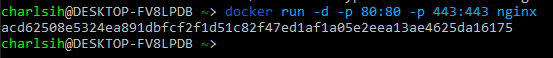
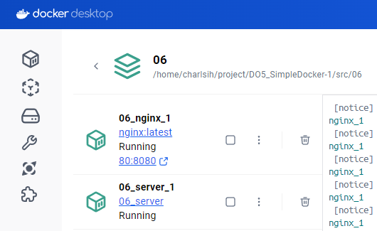

# Simple Docker

## Contents


1. [Part 1. Готовый докер](#part-1-готовый-докер) 
2. [Part 2. Операции с контейнером](#part-2-операции-с-контейнером) 
3. [Part 3. Мини веб-сервер](#part-3-мини-веб-сервер) 
4. [Part 4. Свой докер](#part-4-свой-докер) 
5. [Part 5. Dockle](#part-5-dockle) 
6. [Part 6. Базовый Docker Compose](#part-6-базовый-docker-compose)

## Part 1. Готовый докер

##### Возьми официальный докер-образ с **nginx** и выкачай его при помощи `docker pull`.


##### Проверь наличие докер-образа через `docker images`.
  - `docker images` - посмотреть все образы
  - `docker images nginx` - посмотреть образы с nginx
  


##### Запусти докер-образ через `docker run -d [image_id|repository]`.
  - `docker run -d nginx` - указываем имя образа для запуска
  - `docker run -d 9527c0f683c3` - указываем image_id
  


**Команда docker run** 
- используется для создания и запуска контейнера на основе Docker-образа.

Параметры: 
- `-d` или `--detach` - запуск контейнера в фоновом режиме (в "detached" режиме).
- `-p` или `--publish`- проброс портов контейнера к хост-машине.
- `-v` или `--volume`- применение монтирования томов данных или хост-директорий к контейнеру.
- `--name`- назначение имени контейнеру.
- `-e` или `--env` - установка переменных окружения в контейнере.

##### Проверь, что образ запустился через `docker ps`.
  - `docker ps` - показывает запущенные контейнеры
  - `docker ps -a` - показывает все контейнеры
  


##### Посмотри информацию о контейнере через `docker inspect [container_id|container_name]`.
  - `docker inspect focused_jemison` - указываем имя контейнера
  - `docker inspect 57d48456fbdd` - указываем id контейнера


##### По выводу команды определи и помести в отчёт размер контейнера, список замапленных портов и ip контейнера.
  - размер контейнера -  "ShmSize": 67108864 \
    
  - список замапленных портов - "ExposedPorts": "80/tcp" \
    
  - ip контейнера - "IPAddress": "172.17.0.2" \
    

##### Останови докер контейнер через `docker stop [container_id|container_name]`.
##### Проверь, что контейнер остановился через `docker ps`.
  - `docker stop focused_jemison` - указываем имя контейнера
  - `docker stop 57d48456fbdd` - указываем id контейнера

  


##### Запусти докер с портами 80 и 443 в контейнере, замапленными на такие же порты на локальной машине, через команду *run*.
  - `docker run -d -p 80:80 -p 443:443 nginx`



##### Проверь, что в браузере по адресу *localhost:80* доступна стартовая страница **nginx**.


##### Перезапусти докер контейнер через `docker restart [container_id|container_name]`.
  - `docker restart focused_jemison` - указываем имя контейнера
  - `docker restart 57d48456fbdd` - указываем id контейнера


##### Проверь любым способом, что контейнер запустился.


## Part 2. Операции с контейнером

##### Прочитай конфигурационный файл *nginx.conf* внутри докер контейнера через команду *exec*.
  - `docker exec` - выполнение команды внутри работающего контейнера. \
  `docker exec focused_jemison cat /etc/nginx/nginx.conf` 
  - или запускаем терминал в контейнере и читаем файл \
    `docker exec -it focused_jemison bash` \
    `cat /etc/nginx/nginx.conf`


##### Создай на локальной машине файл *nginx.conf*.
  - `nano nginx.conf`

##### Настрой в нем по пути */status* отдачу страницы статуса сервера **nginx**.
  


##### Скопируй созданный файл *nginx.conf* внутрь докер-образа через команду `docker cp`.
  - `docker cp nginx.conf romantic_clarke:/etc/nginx/nginx.conf`

##### Перезапусти **nginx** внутри докер-образа через команду *exec*.
  - `docker exec romantic_clarke nginx -s reload` - подаем сигнал (-s) на перезагрузку

##### Проверь, что по адресу *localhost:80/status* отдается страничка со статусом сервера **nginx**.
- `curl -i localhost:80/status` - отправляем GET-запрос на localhost:80/status


##### Экспортируй контейнер в файл *container.tar* через команду *export*.
  - `docker export -o container.tar romantic_clarke`
  - `docker export romantic_clarke > container2.tar`


##### Останови контейнер.
  - `docker stop romantic_clarke`


##### Удали образ через `docker rmi [image_id|repository]`, не удаляя перед этим контейнеры.
  - `docker rmi nginx -f` - флаг `-f` или `--force` указывает на принудительное удаление образа, даже если он используется в контейнерах.


##### Удали остановленный контейнер.
  - `docker rm romantic_clarke`
  - `docker ps -a`


##### Импортируй контейнер обратно через команду *import*.
  - `docker import -c 'CMD ["nginx", "-g", "daemon off;"]' container.tar test_container`


##### Запусти импортированный контейнер.
  - `docker container run -d -p 80:80 test_container`

##### Проверь, что по адресу *localhost:80/status* отдается страничка со статусом сервера **nginx**.


## Part 3. Мини веб-сервер

##### Напиши мини-сервер на **C** и **FastCgi**, который будет возвращать простейшую страничку с надписью `Hello World!`.


##### Запусти написанный мини-сервер через *spawn-fcgi* на порту 8080.

`docker pull nginx` \
`docker run -d -p 81:81 [image_id|repository]`\
`docker ps` \
`docker cp nginx.conf [container_id|container_name]:/etc/nginx/` \
`docker cp server.c [container_id|container_name]:/home/` \
`docker exec -it [container_id|container_name] bash` \
`apt-get update` \
`apt-get install gcc` \
`apt-get install spawn-fcgi` \
`apt-get install libfcgi-dev` \
`gcc server.c -lfcgi -o server` \
`spawn-fcgi -p 8080 ./server` \
`nginx -s reload` \


##### Напиши свой *nginx.conf*, который будет проксировать все запросы с 81 порта на *127.0.0.1:8080*.


##### Проверь, что в браузере по *localhost:81* отдается написанная тобой страничка.


##### Положи файл *nginx.conf* по пути *./nginx/nginx.conf* (это понадобится позже).
`mkdir nginx` \
`mv nginx.conf nginx/nginx.conf`


## Part 4. Свой докер

#### Напиши свой докер-образ, который:
1) собирает исходники мини сервера на FastCgi из Части 3;
2) запускает его на 8080 порту;
3) копирует внутрь образа написанный *./nginx/nginx.conf*;
4) запускает **nginx**. \
(**nginx** можно установить внутрь докера самостоятельно, а можно воспользоваться готовым образом с **nginx**'ом, как базовым.)

*При написании докер-образа избегай множественных вызовов команд RUN*

**Dockerfile** 
- текстовый файл, в котором определяются инструкции для построения Docker-образа. Он содержит шаги, такие как установка зависимостей, копирование файлов, настройка сети и другие команды, необходимые для создания образа. \
Команды в Dockerfile выполняются последовательно сверху вниз. Они настраивают окружение и приложение внутри контейнера.

Основные команды:

FROM - определяет базовый образ, на основе которого будет создан ваш образ. Пример: FROM ubuntu:latest \
USER - устанавливает пользователя, от имени которого будут выполняться последующие команды. \
COPY - копирует файлы и директории из контекста сборки (локальной файловой системы) внутрь образа. \
RUN - выполняет команды внутри образа во время сборки. Это может быть использовано для установки пакетов, выполнения команд конфигурации и т.д.\
WORKDIR - устанавливает рабочую директорию внутри образа, где будут выполняться последующие команды. \
CMD - определяет команду, которая будет выполняться при запуске контейнера на основе образа. Обычно используется для запуска приложения. \
ENTRYPOINT - определяет исполняемый файл, который будет запущен при запуске контейнера. Может использоваться для настройки точки входа приложения.


##### Собери написанный докер-образ через `docker build` при этом указав имя и тег.
  - `docker build -t server -f 04/Dockerfile .` - запускаем из /src, указываем ее как текущую директорию (. в конце) и указываем папку с докер файлом.\
  Иначе не работают относительные пути в докер файле. Потому что по умолчанию Docker ограничивает контекст сборки текущей директорией (где находится Dockerfile) и ее поддиректориями.


##### Проверь через `docker images`, что все собралось корректно.


##### Запусти собранный докер-образ с маппингом 81 порта на 80 на локальной машине и маппингом папки *./nginx* внутрь контейнера по адресу, где лежат конфигурационные файлы **nginx**'а.

  - `docker run -d -p 80:81 -v /home/charlsih/project/DO5_SimpleDocker-1/src/nginx/nginx.conf:/etc/nginx/nginx.conf server`


##### Проверь, что по localhost:80 доступна страничка написанного мини сервера.


##### Допиши в *./nginx/nginx.conf* проксирование странички */status*, по которой надо отдавать статус сервера **nginx**.


##### Перезапусти докер-образ.
  - `docker restart amazing_chandrasekhar` 

*Если всё сделано верно, то, после сохранения файла и перезапуска контейнера, конфигурационный файл внутри докер-образа должен обновиться самостоятельно без лишних действий*.


##### Проверь, что теперь по *localhost:80/status* отдается страничка со статусом **nginx**


## Part 5. **Dockle**

**Dockle** 
— инструмент для проверки безопасности образов контейнеров, который можно использовать для поиска уязвимостей. Кроме того, с его помощью можно выполнять проверку на соответствие Best Practice, чтобы убедиться, что образ действительно создаётся на основе сохраненной истории команд.

Устанавливаем Dockle

``` shell
$ VERSION=$(
 curl --silent "https://api.github.com/repos/goodwithtech/dockle/releases/latest" | \
 grep '"tag_name":' | \
 sed -E 's/.*"v([^"]+)".*/\1/' \
) && curl -L -o dockle.deb https://github.com/goodwithtech/dockle/releases/download/v${VERSION}/dockle_${VERSION}_Linux-64bit.deb
$ sudo dpkg -i dockle.deb && rm dockle.deb
```


##### Просканируй образ из предыдущего задания через `dockle [image_id|repository]`.
  - `dockle server`


##### Исправь образ так, чтобы при проверке через **dockle** не было ошибок и предупреждений.
  - `docker build -t server2:new -f 05/Dockerfile .`
  - `docker run -d --name server server2:new`
  - `dockle -i CIS-DI-0010 server2:new` \
  (проверка образа с идентификатором CIS-DI-0010 согласно CIS Docker Benchmark (версия 1.2.0) на соответствие безопасным настройкам)


## Part 6. Базовый **Docker Compose**

**Docker Compose** 
- это инструмент для определения и управления многоконтейнерными приложениями в Docker-среде.

`docker-compose.yml` - это файл конфигурации, в нем:
  - `version` - указывает версию синтаксиса docker-compose.yml файла.
  - `services` - определяет список сервисов, которые должны быть развернуты.
  - `build` - определяет путь к Dockerfile или контекст сборки для сервиса.
  - `image` - указывает имя Docker-образа, который должен быть использован для сервиса.
  - `ports` - пробрасывает порты контейнера на хостовую машину.
  - `volumes` - определяет примонтированные тома для контейнера.

##### Напиши файл *docker-compose.yml*, с помощью которого:
 1) Подними докер-контейнер из Части 5 
_(он должен работать в локальной сети, т. е. не нужно использовать инструкцию **EXPOSE** и мапить порты на локальную машину)_.
 2) Подними докер-контейнер с **nginx**, который будет проксировать все запросы с 8080 порта на 81 порт первого контейнера. \
 Замапь 8080 порт второго контейнера на 80 порт локальной машины.


##### Останови все запущенные контейнеры.


##### Собери и запусти проект с помощью команд `docker-compose build` и `docker-compose up`.




##### Проверь, что в браузере по *localhost:80* отдается написанная тобой страничка, как и ранее.

